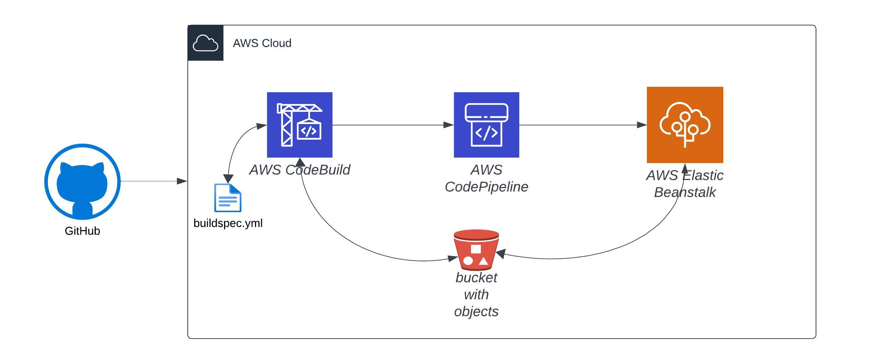

# Continuous Integration and Continuous Deployment using AWS CodePipeline Example

## Architecture

## Problem Statement
Create a CI/CD pipeline for a simple web application using AWS CodePipeline, AWS CodeBuild, and AWS Elastic Beanstalk. The pipeline should automatically build, test, and deploy the application to Elastic Beanstalk whenever there is a change to the code in the repository.

## Requirements
- [X] The web application must be hosted on Elastic Beanstalk.
- [X] The CI/CD pipeline must be defined using AWS CodePipeline.
- [X] The pipeline must build the application using AWS CodeBuild.
- [X] The pipeline must deploy the application to Elastic Beanstalk using the CodePipeline to Elastic Beanstalk integration.
- [X] The pipeline must be triggered automatically whenever there is a change to the code in the repository.
- [ ] Add any one of Unit or Integration tests to the application and configure the pipeline to run the tests before deploying the application.

# Documentation of task

## Flow
- Source: Github
- Continuous Integration: AWS CodeBuild - leveraged `buildspec.yml` to build the codebase
- Continuous Deployment: AWS CodeDeploy - leveraged Amazon Elastic BeanStalk for deployment

## REST Endpoints
- Actuator endpoints are enabled under `/actuator/*`
- Sample `HelloController` enabled under `/hello`.